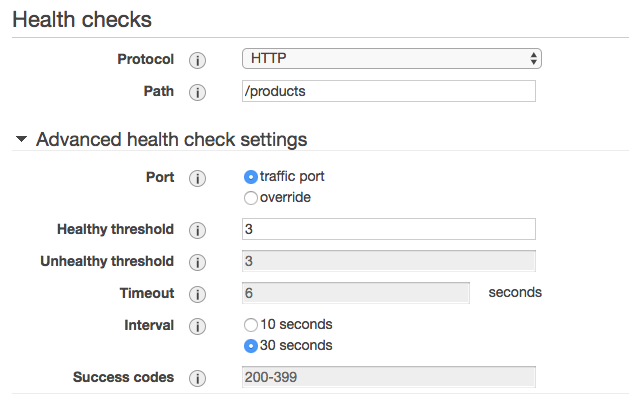

# Lab 1:

In this lab, you will launch a CloudFormation stack that will create Amazon Virtual Private Cloud (VPC)s environment, an application running in ECS and a Cloud9 IDE Instance that you will use in the rest of the workshop.

Cloud9 is only used in this case to avoid requiring participants from having to install the AWS CLI or use tools like curl directly from their laptop.

## Step-by-step Instructions

### Setting Up the Environment

1. Go the AWS Management Console, click **Services** then select **CloudFormation** under Management Tools.  Additionally, you can simply type 

2. First, we need to launch the CloudFormaton Template to create our environment.
You can launch this CloudFormation stack in your account by licking on the **Launch Stack** button below, then clicking **Next**.

Region| Launch
------|-----
| US East (Ohio) - (us-east-2) | [](https://console.aws.amazon.com/cloudformation/home?region=us-east-2#/stacks/new?stackName=ARC311&templateURL=https://s3-us-west-2.amazonaws.com/arc311-region1-cloudformation/master.yaml) |
| US East (N. Virginia) - (us-east-1) | [](https://console.aws.amazon.com/cloudformation/home?region=us-east-1#/stacks/new?stackName=ARC311&templateURL=https://s3-us-west-2.amazonaws.com/arc311-region1-cloudformation/master.yaml) |
| US West (Oregon) - (us-west-2) | [](https://console.aws.amazon.com/cloudformation/home?region=us-west-2#/stacks/new?stackName=ARC311&templateURL=https://s3-us-west-2.amazonaws.com/arc311-region1-cloudformation/master.yaml) |


3. On the next screen, Step 2, leace the *Stack Name* at the default of **ARC311** and click **Next**.
> Note:  If you are sharing accounts, and someone has this stack name, this stack will fail.  We suggest you do not share accounts, but if you have no other alternative, make sure you launch in  different regions.

4. On the Configure Stack Options page, accept all the defaults and click **Next**. Finally, on the Review page, check the **IAM Resource Acknowledgement** box and click **Create Stack**.
It will take a approximitely 10 minutes for the Stack to create. Wait until the stack is fully launched and shows a Status of CREATE_COMPLETE.
> This CloudFormation template will launch multiple child stacks.  Once complete, you will have 2 VPCs with subnets, NAT Gateways, security groups, etc.  Additonally, it will launch a Cloud9 instance, an Elastic Container Service (ECS) cluster, an Application Load Balancer, and 2 services that will run in the ECS cluster (Website service and product service)

### Configuring VPC Flow Logs
Some of our traffic will be using public IP addresses and then we will make our application private.  VPC flow logs will help us confirm that we are successful in dowing so.  We will write the VPC flow logs to S3 and later use Athena to query them.  You can learn more about VPC flow logs and the record syntax here in the [VPC Flow Flogs Documentation.](https://docs.aws.amazon.com/vpc/latest/userguide/flow-logs.html)

7. From the Cloudformation Console, click on your main ARC311 stack (the master stack).  

	

8. When the stack creation is complete, click the **Outputs** tab for the stack and find the S3 bucket ARN. Copy this ARN to your clipboard or notepad.  You will need this in a later step.

	

2.  Open the [*VPC console*](https://console.aws.amazon.com/vpc/) in a *NEW* tab in your browser.  *Look in the top right-had corner and confirm that you are in the same region you launched your template in!*  This will save a lot of back and forth in the management console.  From the right-hand navigation pane, click **Your VPCs**.  You should see 2 VPCs created by Cloudformatin as well as the default VPC.

	

2. From the top left-hand side of the VPC console, click in the **Select a VPC** drop down and select VPC1.  This VPC has your application running in it.  This is a containerized application that ECS is managing.  

	
	
3.  Let's turn on VPC flow logs for these VPCs.  Once the VPC is selected, in the bottom pane, click on the **Flow Logs** tab.
	
	

4. Click **Create flow log**.

5. From the *Filter* drop down select **ALL**.  Next, choose the **Send to a S3 bucket** radio buttion.  You can get the bucket name from the **Outputs** tab from the main ARC311 stack.  The arn should look like this: `arn:aws:s3:::arc311-s3bucket-1erbhppavsb0w-loggingbucket-1dfykskj12345`

	

6. Click **Create**.

7. Repeat these same steps for **VPC2**.  Remember to select VPC 2 in the top left hand corner, then create the flow log to the same S3 bucket ARN.

### Testing the application using Cloud9 IDE

While it may seem odd to use an IDE to use a tool like curl, Cloud9 comes with a terminal, so you can run commands in your VPC from your browser.  Your Cloud9 instance is running in VPC2.  The only way to access your application is via the Application Load balancer that sits in the public subnets in VPC1.  The application is in the provate subnets in VPC1.

7. From the Cloudformation Console, click on your main ARC311 stack (the master stack).  

	

8. When the stack creation is complete, click the **Outputs** tab for the stack and select the value for **Cloud9 IDE**. Open that URL in a new browser tab to load your IDE environment.

	

8. In the lower pane of your **Cloud9 IDE**, you will have a terminal that looks like the below.  

	

9.  Go back to your CloudFormation console so we can get the DNS name of your ALB.  From the CloudFormation **Outputs** tab, copy the dns name for the application and attempt to curl.

	
	
10.  From your CLoud9 IDE, paste DNS name for the product service.  You should see a JSON response.

```
curl MYSTACKNAME.MYREGION.elb.amazonaws.com/products
```

> We just accessed out service that lives in a private subnet in a different VPC via a Application Load Balancer in a public subnet.  We can continue to build services that have a public endpoint, or we can make the service private.

### Create NLB for PrivateLink
Now that we know that the service is functional and can be reached via the public internet.  There are many reasons why you may not want your service to be accessible to the public internet, so let's set up *Private link* so that our Cloud9 instance or perhaps another microservice in our VPC2 can connect. 

1.  First, we need to create an endpoint service in VPC2 for our application.  Open the **EC2 console** at https://console.aws.amazon.com/ec2/.  Verify you are in the **same Region**

2. From the left hand pane, choose **Load Balancers**.

3. Click on the **Create Load Balancer** button

4.  You will see 3 options of load balancers.  We will need to use the Layer 4 load balancer which is the Network Load Balancer.  Find the *Network Load Balancer* in the middle and select **Create**.

5. For the *Configure Load Balancer* Page:
	* Give your load balancer a name like `PrivateLink-<MYINITIALS>`.  
	* Select the **internal** radio button for *Scheme*
	* Leave the listeners as default
	* Select **VPC1** as the VPC and click the boxes for each Availability zone to select the Private subnets for each zone.  
	
6. Click **Next: Configure Routing**.  

7. Under *Target Group*:
	* Select **New target group**
	* For *Name*, type `ProductService`
	* Leave **Instance** select as the *Target Type*
	
	
8. In the *Health Checks* section:
	* Select **HTTP* as the protocol
	* Type `/products` as the path
	* Leave the rest of the health check settings as default

	

9. Click **Next:Register Targets**.

10. On the *Step 3: Register Targets* page, click on the *4 ECS Hosts* in the bottom pane and click the **Add to Registered** button.

	

11. Click **Next: Review** and lastly click **Create** on the *Step 4: Review* page.

> We now have an internal Network Load Balancer with our backend ECS Hosts registered.  This is what our architecture looks like right now.  
> 	

### Create Endpoint Service for PrivateLink

14. Open the *VPC console*.  In the left-handnavigation pane, choose **Endpoint Services**, then  click **Create Endpoint Service**.

15. For Associate Network Load Balancers, select the Network Load Balancers to associate with the endpoint service.

16. For Require acceptance for endpoint, select the check box to accept connection requests to your service manually. If you do not select this option, endpoint connections are automatically accepted.

17. Choose Create service.

18. After you've created your endpoint service configuration, you can control which service consumers can create an interface endpoint to connect to your service. Service consumers are IAM principals—IAM users, IAM roles, and AWS accounts.

19. You should still be in the VPC console.  In the navigation pane, choose Endpoint Services and select your endpoint service.

20. Choose Actions, Add principals to whitelist.  Specify * to add permissions for all principals.  NOTE:  this is not following the least privilage security model and we are only doing this for the purpose of this lab.  We suggest you whitelist the appropriate accounts, IAM roles and users.

21. Choose Add to Whitelisted principals.


22. Now we have a service, but we need to create an interface endpoint in VPC B

23. To create an interface endpoint to an endpoint service, open the Amazon VPC console at https://console.aws.amazon.com/vpc/.

24. In the navigation pane, choose Endpoints, Create Endpoint.

25. For Service category, choose Find service by name.

26. For Service Name, enter the name of the service (for example, com.amazonaws.vpce.us-east-1.vpce-svc-0e123abc123198abc) and choose Verify.

27. Complete the following information and then choose Create endpoint.

28. For VPC, select a VPC in which to create the endpoint.

29. For Subnets, select the subnets (Availability Zones) in which to create the endpoint network interfaces.

30. For Security group, select the security groups to associate with the endpoint network interfaces.

> Now we need to accept the interface endpoint. After you've created an endpoint service, service consumers for which you've added permission can create an interface endpoint to connect to your service.

> We have specified that acceptance is required for connection requests, therefore you must make a API call or use the console to accept or reject interface endpoint connection requests to your endpoint service. After an interface endpoint is accepted, it becomes available.


31. Open the Amazon VPC console

32. In the navigation pane, choose Endpoint Services and select your endpoint service.

33. The Endpoint Connections tab lists endpoint connections that are currently pending your approval. Select the endpoint, choose Actions, and choose Accept.

34. Copy the DNS name from your endpoint service.

35. Now we can test our service again!  From the Cloud9 IDE, open that URL in a new browser tab to load your IDE environment.  We will use curl against the DNS name of our endpoint service.

curl myprivateapp
