# Lab 1:

In this lab, you will launch a CloudFormation stack that will create two Amazon Virtual Private Clouds (VPCs), an application running in ECS and a Cloud9 IDE Instance that you will use in the rest of the workshop.  

Below is a diagram of what the architecture will look like once CloudFormation has finished deploying all the resources.  We will build on top of this architecture.


We will deploy new ECS services behind a Network Load Balancer (NLB) and configure an Endpoint Service and an Endpoint.  Once complete, we will have a new and fully private service between out 2 VPCs.

*Cloud9* is only used in this case to avoid requiring participants from having to install the AWS CLI or use tools like curl directly from their laptop.


## Step-by-step Instructions

### Setting Up the Environment

1. First, we need to launch the CloudFormaton Template to create our environment.
You can launch this CloudFormation stack in your account by *right-clicking* on the **Launch Stack** button and *opening in a new browser tab*. In the new tab, click **Next**.


Region| Launch
------|-----
| US East (Ohio) - (us-east-2) | [](https://console.aws.amazon.com/cloudformation/home?region=us-east-2#/stacks/new?stackName=ARC311&templateURL=https://s3-us-west-2.amazonaws.com/arc311-region1-cloudformation/master.yaml) |
| US East (N. Virginia) - (us-east-1) | [](https://console.aws.amazon.com/cloudformation/home?region=us-east-1#/stacks/new?stackName=ARC311&templateURL=https://s3-us-west-2.amazonaws.com/arc311-region1-cloudformation/master.yaml) |
| US West (Oregon) - (us-west-2) | [](https://console.aws.amazon.com/cloudformation/home?region=us-west-2#/stacks/new?stackName=ARC311&templateURL=https://s3-us-west-2.amazonaws.com/arc311-region1-cloudformation/master.yaml) |


2. On the next screen, Step 2, leave the *Stack Name* at the default of **ARC311** and click **Next**.
> Note:  If you are sharing accounts, and someone has this stack name, this stack will fail.  We suggest you do not share accounts, but if you have no other alternative, make sure you launch in  different regions.

3. On the Configure Stack Options page, accept all the defaults and click **Next**. Finally, on the Review page, check all the **Acknowledgement** boxes and click **Create Stack**.
It will take a approximitely 10 minutes for the Stack to create. Wait until the `ARC311` stack is fully launched and shows a Status of `CREATE_COMPLETE`.
> This CloudFormation template will launch **multiple child stacks**.  Once complete, you will have 2 VPCs with subnets, NAT Gateways, security groups, etc.  Additonally, it will launch a Cloud9 instance, an Elastic Container Service (ECS) cluster, an Application Load Balancer, and 2 services that will run in the ECS cluster (Website service and Product service).

### Configuring VPC Flow Logs
Some of our traffic will be using public IP addresses and then we will make our application private.  VPC flow logs will help us identify what traffic is allowed and denied.  We will write the *VPC flow logs* to *S3* and later use *Athena* to query them in an optional lab.  You can learn more about VPC flow logs and the record syntax in the [VPC Flow Logs Documentation.](https://docs.aws.amazon.com/vpc/latest/userguide/flow-logs.html)

1. From the **CloudFormation Console**, select your main *ARC311* stack (the master stack).  

	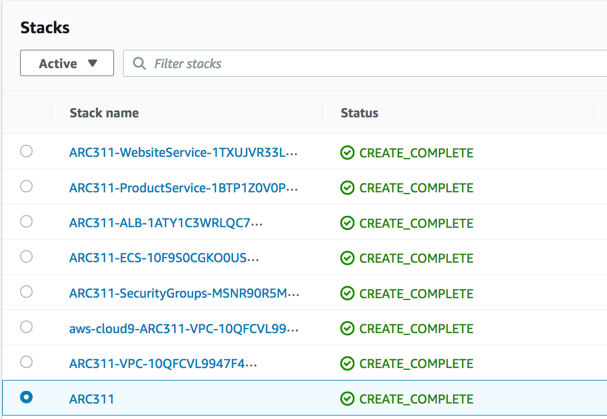

2. When the stack creation is complete, click the **Outputs** tab for the stack and find the S3 bucket ARN ([Amazon Resource Name](https://docs.aws.amazon.com/general/latest/gr/aws-arns-and-namespaces.html)). Copy this ARN to your clipboard or notepad.  You will need this in a later step.

	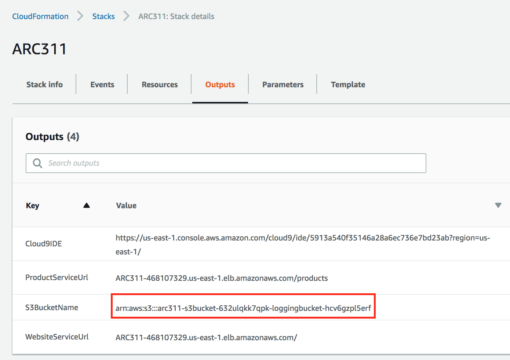

3.  Open the [*VPC console*](https://console.aws.amazon.com/vpc/) in a *NEW* tab in your browser.  *Look in the top right-had corner and confirm that you are in the same region you launched your template in!*  This will save a lot of back and forth in the management console.  From the right-hand navigation pane, click **Your VPCs**.  You should see 2 VPCs created by CloudFormation as well as the default VPC.

	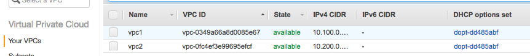

4. From the top left-hand side of the VPC console, click in the **Select a VPC** drop down and select **VPC1**.  This VPC has your application running in it.  This is a containerized application that ECS is managing.  

	
	
5.  Let's turn on VPC flow logs for these VPCs.  Once the VPC is selected, in the bottom pane, click on the **Flow Logs** tab.
	
	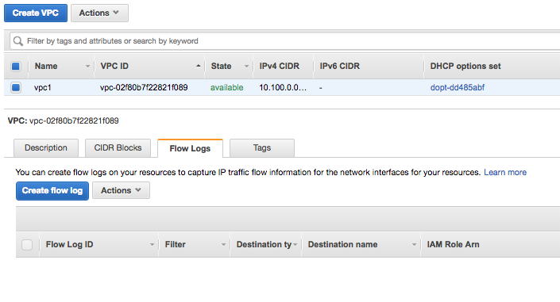

6. Click **Create flow log**.

7. From the *Filter* drop down select **ALL**.  Next, choose the **Send to a S3 bucket** radio buttion.  You can get the bucket name from the **Outputs** tab from the main ARC311 stack.  The arn should look like this: `arn:aws:s3:::arc311-s3bucket-1erbhppavsb0w-loggingbucket-1dfykskj12345`

	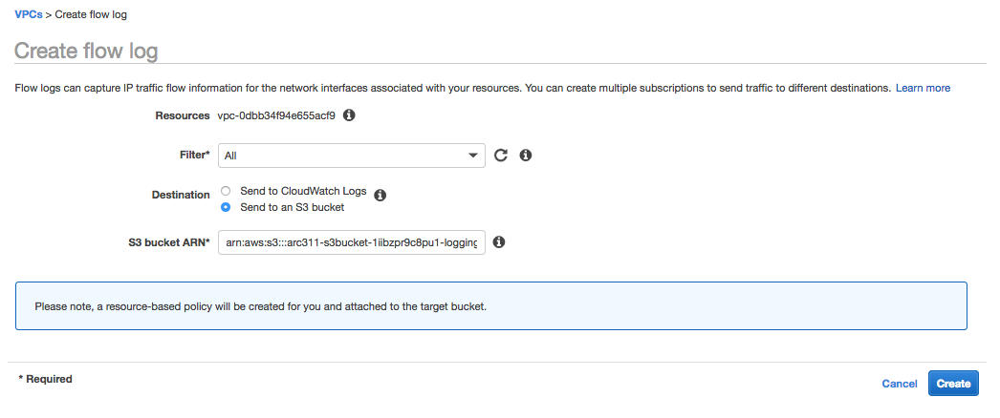

8. Click **Create**.

9. Repeat these same steps for **VPC2**.  Remember to select **VPC2** in the top left-hand corner, then create the flow log to the same S3 bucket ARN.

### Testing the application using Cloud9 IDE

While it may seem odd to use an IDE to use a tool like curl, Cloud9 comes with a terminal so you can run commands in your VPC from your browser.  Your Cloud9 instance is running in VPC2.  The only way to access your application is via the Application Load balancer that sits in the public subnets in VPC1.  The application is in the private subnets in VPC1.

1. From the CloudFormation Console, click on your main ARC311 stack (the master stack).  

	

2. Click the **Outputs** tab for the stack and select the value for **Cloud9 IDE**. Open that URL in a new browser tab to load your IDE environment.

	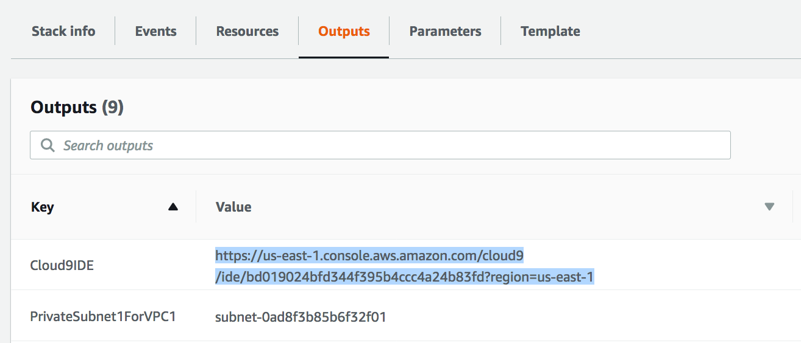

3. In the lower pane of your **Cloud9 IDE**, you will have a terminal in the lower pane of your Cloud9 IDE.  

	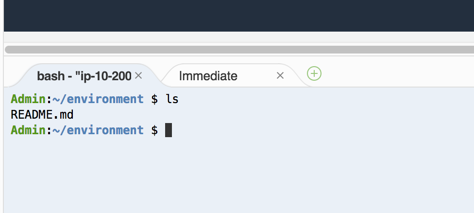

4.  Go back to your CloudFormation console so we can get the **DNS name of your Application Load Balancer (ALB)**.  From the CloudFormation **Outputs** tab, copy the DNS name for the `WebsiteServiceURL`.

	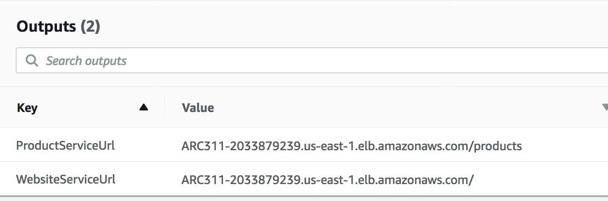
	
5.  From your Cloud9 IDE, paste the command below for the website. Be sure you copy your DNS name for **your load balancer** from the **Outputs** tab. We want to check that we get a `200 OK` as a response.

	```console
	curl -vo /dev/null  REPLACEME-MYSTACKNAME.MYREGION.elb.amazonaws.com/
	```
	> You should get a response like:
	
	```console
			  % Total    % Received % Xferd  Average Speed   Time    Time     Time  Current
		                                 Dload  Upload   Total   Spent    Left  Speed
		  0     0    0     0    0     0      0      0 --:--:-- --:--:-- --:--:--     0*   Trying 18.220.31.125...
		* TCP_NODELAY set
		* Connected to arc311-12345678.us-east-2.elb.amazonaws.com (18.220.31.125) port 80 (#0)
		> GET / HTTP/1.1
		> Host: arc311-12345678.us-east-2.elb.amazonaws.com
		> User-Agent: curl/7.53.1
		> Accept: */*
		> 
		< HTTP/1.1 200 OK
		< Date: Mon, 19 Nov 2018 20:24:18 GMT
		< Content-Type: text/html; charset=utf-8
		< Content-Length: 658
		< Connection: keep-alive
		< 
		{ [658 bytes data]
		100   658  100   658    0     0   8578      0 --:--:-- --:--:-- --:--:--  8657
		* Connection #0 to host arc311-12345678.us-east-2.elb.amazonaws.com left intact
	```

11. From your Cloud9 IDE, paste DNS name for the product service.  You should see a JSON response directly from the Product Service of our application.

	```
	curl REPLACEME-MYSTACKNAME.MYREGION.elb.amazonaws.com/products
	```

> We just accessed our service that lives in a private subnet in a different VPC via an Application Load Balancer in a public subnet.  We can continue to build services that have a public endpoint, or we can make the service private.  

### Create NLB for PrivateLink
Now we know that the service is functional and can be reached via the public internet.  There are many reasons why you may not want your service to be accessible to the public internet, so let's set up *PrivateLink* so that our Cloud9 instance or another microservice in VPC2 can connect. 

First, we need to create an *Endpoint Service* in **VPC1** for our application.  An *Endpoint Service* is an application in your VPC that you configure as an **AWS PrivateLink service**.

1.  Open the [**EC2 console**](https://console.aws.amazon.com/ec2/) in a new tab or a new window.  Verify you are in the **Correct Region!**

2. From the left hand pane, choose **Load Balancers**.

3. Click on the **Create Load Balancer** button

4.  You will see 3 options of load balancers.  We will need to use the Layer 4 load balancer which is the Network Load Balancer.  Find the *Network Load Balancer* in the middle and select **Create**.

5. For the *Configure Load Balancer* Page:
	* Give your load balancer a name like `arc311-nlb`.  
	* Select the **internal** radio button for *Scheme*
	* Leave the listeners as default
	* Select **VPC1** as the VPC and click the boxes for BOTH Availability Zones, then select the Private subnets for each zone.  
	
6. Click **Next: Configure Routing**.  

7. Under *Target Group*:
	* Select **New target group**
	* For *Name*, type `NewWebsiteService`
	* Leave **Instance** selected as the *Target Type*
	
	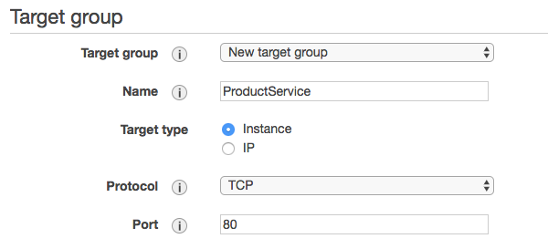
8. In the *Health Checks* section:
	* Select **TCP** as the protocol from the drop down.
	* Leave the rest of the health check settings as default

9. Click **Next:Register Targets**.

10. On the *Step 3: Register Targets* page, click on the *4 ECS Hosts* in the bottom pane and click the **Add to Registered** button.

	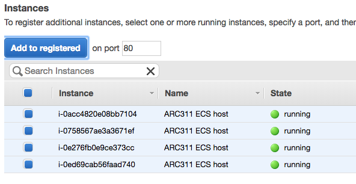

11. Click **Next: Review** and lastly click **Create** on the *Step 4: Review* page, and lastly, click **Close** on the confirmation.

12. We will need the ARN (Amazon Resource Name) for the target group.  From the left hand pane, select **Target Groups**.

13. Select the **NewWebsiteService** and copy the ARN from the bottom pane.

	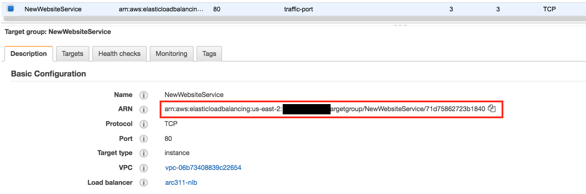

### Create ECS Services to Run Behind Network Load Balancer
We now have a Network load balancer, but now we need to create a website and product service in ECS to register to our NLB.  We will do this configuration via CLI from our Cloud9 instance.

1.  Browse back to your Cloud9 IDE.  We will start by creating the `Product Service`.

2. In the top pane, next to the *Welcome* tab, click on the `+` icon and choose **New File**.
	
	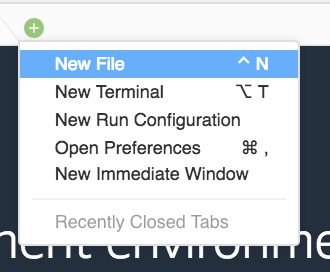

3.  Paste the ARN in the file to store it temporarily.

4.  Within another **New File** in Cloud9, paste the following JSON.


	**IMPORTANT: Update the `targetGroupArn` with the ARN you just pasted in another tab.**


	```
	{
	    "serviceName": "new-product-service",
	    "taskDefinition": "product-service",
	    "loadBalancers": [
	        {
	            "targetGroupArn": "arn:aws:elasticloadbalancing:us-east-2:1234567890:targetgroup/NewWebsiteService/5065959d16408f6e",    
	            "containerName": "product-service",
	            "containerPort": 8001
	        }
	    ],
	    "desiredCount": 2
	}
	
	```
5. At the top of the browser, click **File** then click **Save As** and name the file `new-product-service.json`.
6. Click **Save**.
7. Now let's create the JSON configuration for the *Website Service*.  Open a **New File** in Cloud9.  Paste in the following JSON.

	**IMPORTANT: You will need to update the `targetGroupArn` with the ARN you pasted in another tab.**

	```
	{
	    "serviceName": "new-website",
	    "taskDefinition": "website-service",
	    "loadBalancers": [
	        {
	            "targetGroupArn": "arn:aws:elasticloadbalancing:us-east-2:1234567890:targetgroup/NewWebsiteService/5065959d16408f6e",  
	            "containerName": "website-service",
	            "containerPort": 8000
	        }
	    ],
	    "desiredCount": 2
	}
	
	```
8. At the top of the browser, click **File** then click **Save As** and name the file `new-website-service.json`.
9. Click **Save**.

10.  From the terminal, we will create the new ECS services for the *Website Service* and the *Product Service*.  Run the following to create the **Product Service** referencing the JSON we just saved.

	```aws ecs create-service --service-name new-product-service --cluster ARC311 --cli-input-json file://new-product-service.json```
	
11. Next, run the following to create the **Website Service**.

	```
	aws ecs create-service --service-name new-website-service --cluster ARC311 --cli-input-json file://new-website-service.json
	```

> We now have an internal Network Load Balancer with our backend ECS Hosts registered.  This is what our architecture looks like right now.  
> 	


If you curl our new backend service (like we did before), the request will fail. This is because our Cloud9 instance still has no route or any way to access the new ECS service.  We need to create an *Endpoint Service* in VPC1 where our ECS conatiners live and an *Endpoint* in VPC2 where Cloud9 lives.

### Create Endpoint Service for PrivateLink

1. Open the *VPC console*.  

2. In the left-hand navigation pane, choose **Endpoint Services**, then  click the **Create Endpoint Service** button.

3. For *Associate Network Load Balancers*, select the `arc311-nlb` Network Load Balancer you created earlier to associate with the endpoint service.

	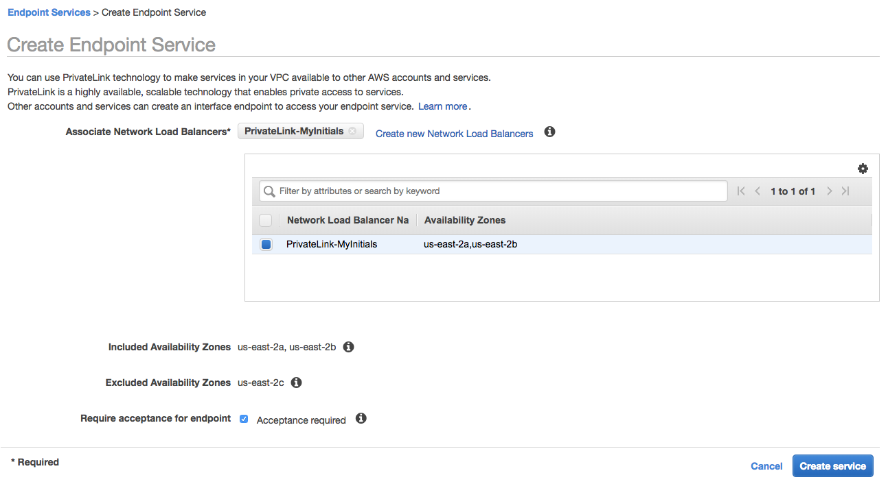

3. For *Require acceptance for endpoint*, select the check box for **Acceptance Reqired** to accept requests to your service manually. 
	>If you do not select this option, endpoint connections are automatically accepted.

4. Click **Create Service**.  You should get a success message like the one below.  Notice that you will be allocated a DNS name for the *Endpoint Service*.  Once finsihed, click **Close**.

	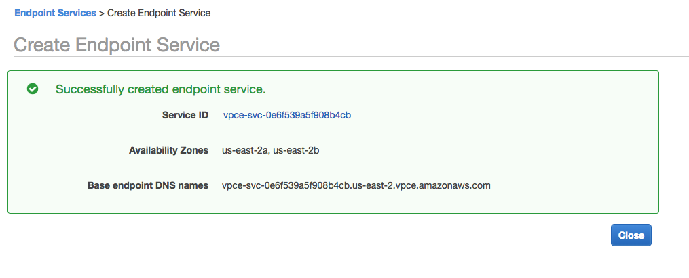

5. Now that you have created an *endpoint service*, you can control which service consumers can create an interface endpoint to connect to your service. Service consumers are IAM principals—IAM users, IAM roles, and AWS accounts.

19. You should still be in the *VPC console*, under *Endpoint Services*. Select your **Endpoint Service**.

20. In the lower pane, click on the **Whitelisted Principals** tab.  
	* Next, Choose **Add principals to whitelist**.  
	* Specify `*` in the ARN filed to add permissions for all principals. 
	* Click **Add to Whitelisted principals**
	
> NOTE:  This is not following the least privilage security model and we are only doing this for the purpose of this lab.  We suggest you whitelist the appropriate accounts, IAM roles and users.  You can add multiple principals at this step as well.


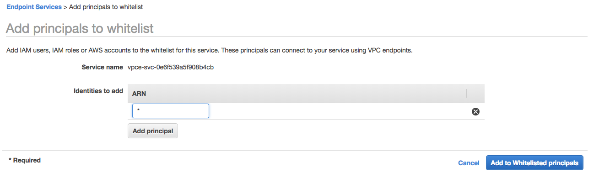

### Create Interface Endpoint for Private Link
At this point, we have our service behind a NLB and configured as an *Endpoint Service*.  However, we have no consumers of our service yet.  This is what our architecture looks like right now:


1.  Let's create an interface endpoint in **VPC2** so that our *Cloud9* instance, or any other service we might spin up in VPC2 can communicate to our service in VPC1.

2. From the *VPC Console*, under **Endpoint Services**, make sure your Endpoint Service is selected.  	
	* You will need to copy the **Service Name** from the *Details* tab, which should look similar to: `com.amazonaws.vpce.us-east-2.vpce-svc-0e6f539a5f123456a`

	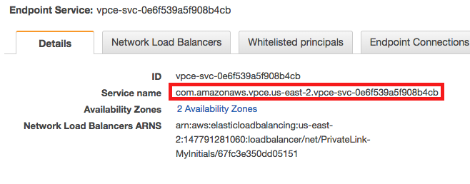

3. From the *VPC console*, choose **Endpoints** (**NOTE** this is different than *Endpoint Service*), then click the **Create Endpoint** button.
	* For *Service category*, choose **Find service by name**.
	* For *Service Name*, paste the name of the service you copied earlier(Example: `com.amazonaws.vpce.us-east-2.vpce-svc-0e6f539a5f123456a`) and click **Verify**.

	

4. In the bottom section of *Create Endpoint*:
	* For *VPC*, select **VPC2** from the dropdown.  This is where our Cloud9 instance is located.
	* For *Subnets*, select the subnets (Availability Zones) in which to create the endpoint network interfaces.  Select the public subnets for VPC 2 (1 in each AZ).
	* For *Security group*, select the security group with a *description* of ***VPC2***.  This will allow all traffic with a source of 10.200.0.0/16.

5.  Click **Create Endpoint**.

	> Now we need to **accept** the interface endpoint. After you've created an Endpoint Service, service consumers for which you've added permission can create an interface endpoint to connect to your service.
	
	> We have specified that acceptance is required for connection requests, therefore you must make a API call or use the console to accept or reject interface endpoint connection requests to your endpoint service. After an interface endpoint is accepted, it becomes available.


6. Now we need to accept the endpoint.  In the left-hand navigation pane, choose **Endpoint Services** and select the **Endpoint Service** that we created earlier.

7. In the lower pane, click the **Endpoint Connections** tab. This tab lists endpoint connections that are currently pending your approval. 

8. Select the *Endpoint*, choose the **Actions** drop down, and click **Accept Endpoint Connection Request**.  

9. Click back to *Endpoints* and select your new endpoint. Copy the *FIRST* DNS name on the details tab from your endpoint.  It should be similar to:

	`vpce-0f14daf3354145ee2-1kx05bsg.vpce-svc-0545a2b2f1afbd610.us-east-1.vpce.amazonaws.com`
	> The bottom 2 endpoints are zonal endpoints.  You will notice that they specify specific AZs in the DNS name (ex. us-east-1a).

10.  First, let's resolve DNS for our **VPC Endpoint**. Run the following in you *Cloud9 Terminal*.  *Be sure to replace the DNS name with YOUR VPC endpoint DNS name!*


	```dig +short REPLACE-ME-vpce-0f14daf3354145ee2-1kx05bsg.vpce-svc-0545a2b2f1afbd610.us-east-1.vpce.amazonaws.com```
	
11.  Two addresses should be returned.  You can also try this with the bottom 2 zonal DNS names that you saw in our console.

10. Now we can test our service again!  From the Cloud9 IDE, we will use curl against the DNS name of our endpoint service adding a `/products` on the end to rech our product service.  Paste the following in ther terminal from Cloud9.

	```
	curl -vo /dev/null REPLACE-ME-vpce-0f14daf3354145ee2-1kx05bsg.vpce-svc-0545a2b2f1afbd610.us-east-1.vpce.amazonaws.com/products
	```
	
**Our architecture now looks like this:**


#### You can now move onto [Lab 2](https://github.com/vaderlia/arc311/tree/master/Lab2)
