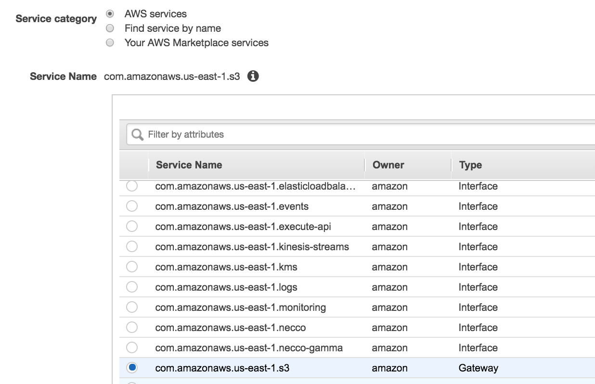

# Lab 2:  Using VPC Gateway Endpoints

As we discussed in the lecture, there are *interface endpoints* and *gateway VPC endpoints*.  Both endpoints allow you to connect to services using private IP ranges, but the Gateway Endpoints are actually specified in your route table instead of creating an Elastic Network Interface (ENI) in your VPC.  We support **S3** and **DynamoDB** Gateway Endpoints.

In additon routing traffic to S3 and DynamoDB via private IPs, Gateway endpoints also prevent the traffic from going through your NAT Gateway or Internet Gateway.  *There are no data processing or hourly charges for using Gateway VPC endpoints*, so these endpoints should be considered for any architecture as a part of your cost optimization.


#### Let's configure a Gateway Endpoint for S3 


1.  Open the *VPC console*.  From the left hand navigation pane, select **Endpoints**.  

2.  Click **Create Endpoint** at the top of the page.  This will open the **Create Endpoint** workflow.

3.  Make sure that the **AWS services** radio buttion is selected for *Service Category* and select **com.amazonaws.us-east-1.s3** in the *Service Name* pane.

	

4. Click in the VPC drop down and select **vpc2 (10.200.0.0/16)**.

5.  Below the **VPC** drop down, select **all route tables** to add the S3 Gateway Endpoint route.

6.  Leave the Policy at *Full Access*, but in production, you can restrict access should you choose.

7.  Click **Create Endpoint**.  Next, click **Close**.

8.  Once created, select the endpoint to view the details, route tables, and the policy.  Note that from the Actions menu, you can manage the route tables and the policy.

### Understanding Gateway Endpoints

1.  Now that you have a *Gateway* endpoint for S3 set up, all traffic destined to S3 will not be routed over the Internet Gateway or NAT Gateway, and instead routed directly to S3 with a source address of your VPC.
2. You will notice that S3 API endpoints will still resolve to public IPs.  You can see these IPs by running the following in your terminal from Cloud9.

	```
	aws ec2 describe-prefix-lists
	```
3. Now let's make a couple API calls to S3.  We have a bucket that we are writing our VPC flow logs to.  We can do a list on that bucket.  Find the bucket name in the **CloudFormation** console in another tab.  Under the parent **ARC311** stack **Output** tab.
4. Run the following command, **replacing your bucket name**:

	```
	aws s3 ls s3://arc311-s3bucket-9dt8hb8y2cpp-loggingbucket-1lhcvvg1g3030
	```
5.  Optionally, you can write the readme file to the bucket.  Be sure to **replace with your bucket name**.
	
	```
	aws s3 cp README.md s3://arc311-s3bucket-9dt8hb8y2cpp-loggingbucket-1lhcvvg1g3030
	```


> In production, you may want to consider adding a bucket policy on S3 buckets that should only be accessed via certain VPCs.  For our lab, we don't want to restrict the bucket policy so we can continue to write VPC flow logs to our bucket. Here is an example policy:
> 
>
```
{
  "Version": "2012-10-17",
  "Id": "Policy1415115909152",
  "Statement": [
    {
      "Sid": "Access-to-specific-VPC-only",
      "Principal": "*",
      "Action": "s3:*",
      "Effect": "Deny",
      "Resource": ["arn:aws:s3:::my_secure_bucket",
                   "arn:aws:s3:::my_secure_bucket/*"],
      "Condition": {
        "StringNotEquals": {
          "aws:sourceVpc": "vpc-111bbb221234"
        }
      }
    }
  ]
}
```

#### You can now move onto Lab 3
