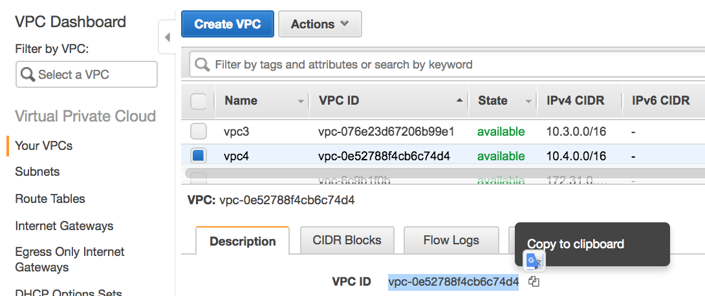
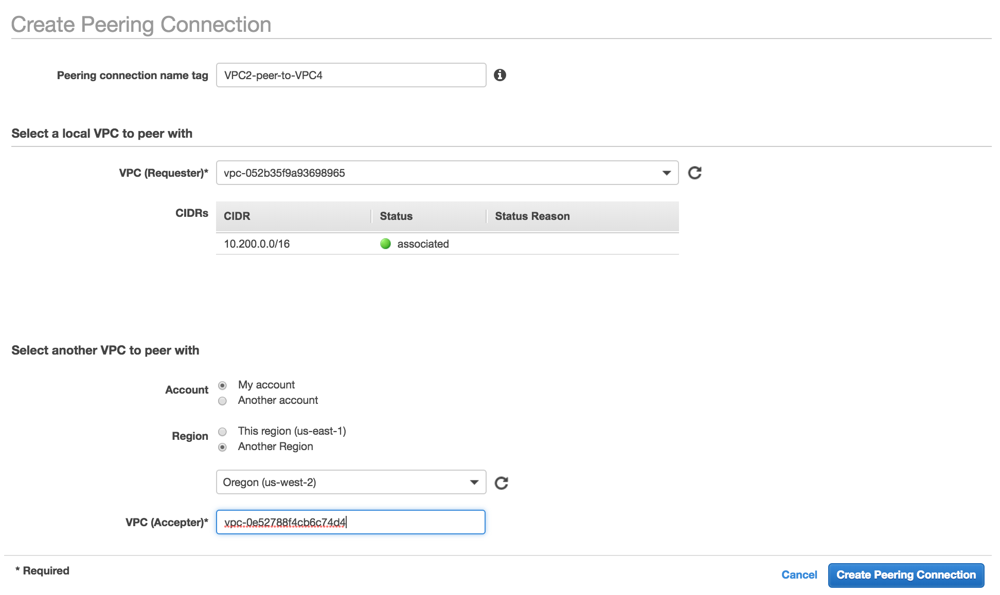
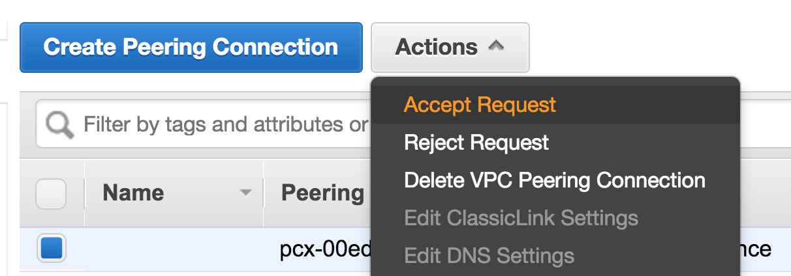
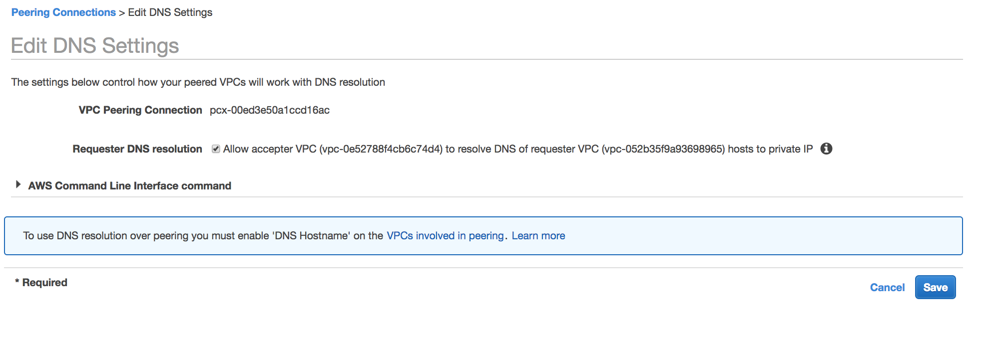
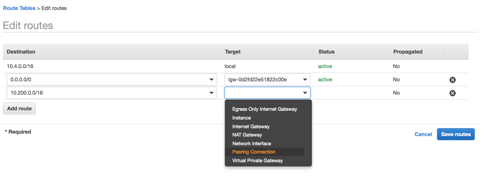

# Lab 3:  Cross Region VPC Peering

So far, we have connected our VPC where our Cloud9 instance runs to our application running in a different VPC.  This works for scenarios where you need a VPC to connect to a specific service in a different VPC or account. This may not meet every use case as sometimes you may need to route between 2 networks (VPCs).  

VPC peering is simply a route between 2 VPCs.  Once you create a peering connection, you will see these routes in your route table.  You can create a peering connection between 2 VPCs in a region or across regions.  Additionally, PrivateLink does not support cross region, therefore if you do have an application or service that needs to replicate cross region or make an API call cross region, you may want to consider Cross Region VPC Peering.  

> One note, be very careful with your design if you do have applications that communicate cross region.  It is important that if one region fails, that your application is not reliant on the resource in the secondary region.  However, scenarios like database replication and other data replication are good use cases for cross region vpc peering.
> 
> Use caution when designing systems that have a service that makes a call to another service in a different region!  This pattern should be avoided unless you have a solution for when the cross region API call fails.

#### Create Cross Region Environment

We have VPC 1 and VPC 2 in one region.  **It is time to take this multi-region!**  After you launch the CloudFormation stack below, our architecture will look like this:

1. Let's start by running a *CloudFormation template* to spin up a VPC3 in a *different region* (i.e. if VPC 1 and 2 are in us-west-2, pick us-east-1).  You will follow the same steps from before in the Cloudformation console.  You can accept all the defaults.  **Make sure you are in a different region!**

> This may take a few minutes.  Once complete, finish below.

You can launch this CloudFormation stack in your account:

Region| Launch
------|-----
| US East (Ohio) - us-east-2 |  |
| US East (N. Virginia) - us-east-1 |  |
| US West (Oregon) - us-west-2 |  |

2.  This Cloudformation template spun up another VPC with the same containerized applications running in ECS and behind a ALB.  

3.  We need to set up a peering connection between VPC2 and our new VPC in another region.  We can also set up a "mesh" to connect each of the VPCs together.  This way, clients in VPC 1 can route to destinations in VPC2 and VPC3.

####  Cross Region VPC Peering

While we can set up peering within the same region, it makes more sense for us to peer cross region with our architecture.

1.  In another tab, open the VPC console for your 2nd region.  Copy the VPC ID for VPC4.

	

2. From the *VPC console* in our first region, select **Peering Connections** on the left hand side. Next, click on **Create Peering Connection**

2.  Give your peering connection a tag of `VPC2-peer-to-VPC4`.

3.  Select VPC2 (10.200.0.0/16) as the VPC requestor.  

4. Click the *Other Region* radio button, select your other region and paste the VPC ID for VPC4 (10.4.0.0/16) as the VPC accepter.

	 
	 
5.   Click **Create Peering Connection** and then close the **Confirmation Message**

#### Accept Peering Request

6.  The peering connection should be in a status of *Pending Acceptance*.  **Change regions** in the top right-hand corner to your **2nd region**.

7. From your 2nd region, click on the **Actions** Drop down and click **Accept Request**.

	

8. Now we have peering set up!  Make note of your peering connection id.  YOu can paste this into your file in Cloud9.

#### Update DNS 
We want to configure our peering connection DNS settings so that queries from the peer VPC resolve to private IP addresses in your local VPC.  We will need to do this for **VPC2** and **VPC4**.

1. In the right-hand navigation pane, choose **Peering Connections**.

2.  Select the **VPC peering connection**, and choose **Actions**, then click **Edit DNS Settings**.

3.  Click the box for DNS resolution for queries from the peer VPC.

	

4. Choose Save.

5.  **Switch regions** from the top right-hand corner, and perform the same steps to update **DNS resolution** in the other region.
6. At the end of these steps, switch to **Region 2** called **Cross Region**.  This has the VPCs with the CIDR ranges `10.3.0.0/16` and `10.4.0.0/16`.

#### Update Route Tables
9. You still need to add a route in your route table.  You can do this by clicking on **Route Tables** in the left hand pane from the VPC console. 

9. From the top left-hand side of the screen, click in the **Select a VPC** drop down and select **VPC4**.  This will filter the route tables to *only* VPC4.

10.  In the middle pane, select the **Public Route Table**, then click the **Routes** tab in the bottom pane.

	

11. Click **Edit Routes**.  In the *Edit Routes* page, click **Add Route**
12. Type `10.200.0.0/16` for the *Destination*.
13. Click the **Target** drop down and select **Peering Connection**

	
	
14. Select the **Peering Connection ID** you just created.
15. Click **Save Routes**
17. Once complete, *change regions* in the top right-hand corner back to your primary region.  You will need to update your **Route Tables** for VPC2.
18. Follow the same steps from before, to update your **VPC2 Public Route tables**.  This time, the Destination will be `10.4.0.0/16`

20. 

#### Using PrivateLink Cross Region

> We mentioned earlier that you should avoid making calls cross region when designing your architecture.  Sometimes this is acceptable, for example, when deploying a proof of concept or if your service can continue to function if the call fails.  
> In the next part of this exercise, we will access our service in **VPC 1** via the PrivateLink endpoint in **VPC 2** over our **VPC Peering Connection**.  The architecture looks like this:

1.  You also have a Cloud9 IDE in your *Region 2* that was launched in your *Cross Region* CloudFormation stack.  From the *2nd Region*, go back to the **CloudFormation** console and copy the link from the Outputs tab into your browser to launch.
2. You will need your *VPC endpoint DNS name* from VPC2.  From another tab, browse to the **VPC Console** for your primary region where the *ARC311* CloudFormation Stack is deployed.
3. Click on **Endpoints* in the left-hand pane, select the proper endpoint for our PrivateLink Service, and copy the DNS name.
4. Click back to your Cloud9 IDE and in the terminal resolve DNS for the endpoint by running the following. **Replace your DNS name!**

	`dig +short REPLACE-ME-vpce-0f14daf3354145ee2-1kx05bsg.vpce-svc-0545a2b2f1afbd610.us-east-1.vpce.amazonaws.com`
	
	> This should return two IP addresses from VPC 2 CIDR range (10.200.0.0/16)

5. To verify that you are in a different VPC, run `ifconfig` from the terminal.  `eth0` should have an IP address like **10.4.0.144**.
6. Finally, let's call our cross region *Product Service* over PrivateLink.  Run the following and **be sure to update with your own DNS name:**

`
curl REPLACE-ME-vpce-0f14daf3354145ee2-1kx05bsg.vpce-svc-0545a2b2f1afbd610.us-east-1.vpce.amazonaws.com/products
`
> You have now created a multi-region architecture utilizing both PrivateLink and VPC Peering!
> 
> In the scenario you just built, the consumer initiating the call to the other region.  It is possible congifure PrivateLink for a NLB in the same region, but use a target group that specifies IPs in another region over a peering connection.  The architecture looks like this:
> 

#### You can now move onto [Lab 4](https://github.com/vaderlia/arc311/tree/master/Lab4) to begin analyzing your VPC traffic.

